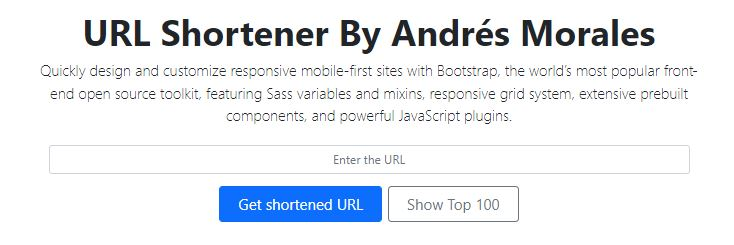
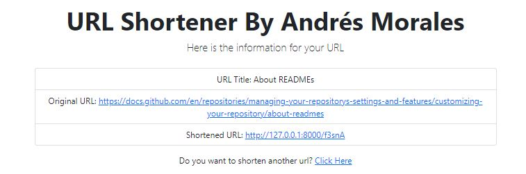
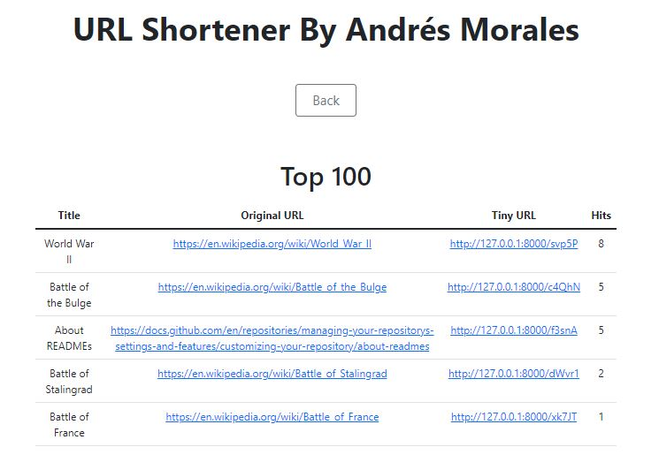

## About this project

This URL Shortener project will.

- Take a given URL
- Check the structure and if the URL exists
- Scrap the Title for the given URL
- Generate a random string for the Shortened URL
- Store the data
- Present the new model to the user

If the Url was alreayd in the system the previous generated will be returned

## To run the project

- Make sure to configure the name, user and pasword for your database on the .env file.
- run these commands
```
php artisan migrate:refresh
php artisan serve
```

## Screenshoots

Homepage image
- Shorten a new URL
- Check the top 100 visited shortened URLS.


When a URL is created or if already existed present the data.


Present the top 100 shortened URLs, order by the number of times each had been queried.

